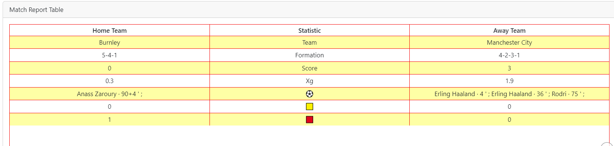
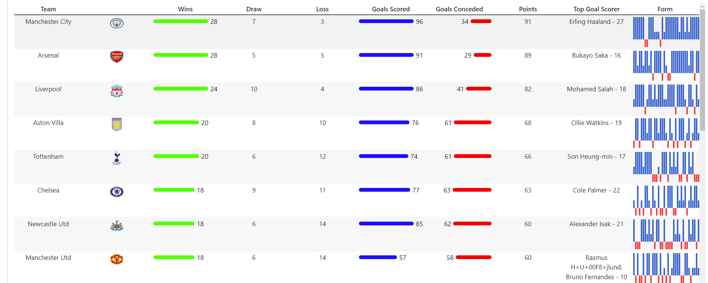
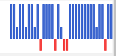

# Premier-League-Summary-Analysis-2023-24

## Project Description:

The idea of the project to display interactive visualizations which includes match-level and season level analysis:

Visualizations are shown at season level and at team level.

Using **{worldfootballR}** package for extracting data for 2023-24 season.The data includes season level and match level data

Using other R libraries like **tidyverse,tidyr ,rvest-for scraping team logos from transfermarkt** etc for data cleaning and manipulations

Table packages {**reactable} and {reactablefmtr**} is used to display the tables in the dashboard)

1.  **Match Summaries**

2.  **Match report**

3.  **Season Level analysis**

**Visualizations are shown at season level and at team leve**l.

**1.Match Summaries**

Every event in a match plays a crucial role in football

From goals to assists to cards etc

Below graphs is represented where in the user selects a team and a corresponding match,

Each event in a match is represented as dot in the graph and when hover over a point the event details are displayed

.png)

This following match shows event level analysis for particular match-Chelsea vs Manchester City in the above example

**2.Match Report**

Match report table displays the Stats like(Goals Scored,Team Name,Xg,Cards etc.)

**3**.**Season Level analysis**

In the above season level analysis for the season 2023-24 overall data is displayed with all the numbers like

-   Goals Scored,Goals Against

-   Win,Loss,Draw

-   Points

-   Top Goal Scorer of the team

Additional **Form** column represents the team form overall for 38 week season

The top Blue bar represents team won that game and the lower blue point represents the team has drawn the game and red indicates the team has lost the game

Using bindCache() functions in Shiny for optimized performance of the dashboard

Application Link: [PL-Analysis](https://harikrishna19.shinyapps.io/PL-Analysis-23-24-season/ "PL-Analysis")
